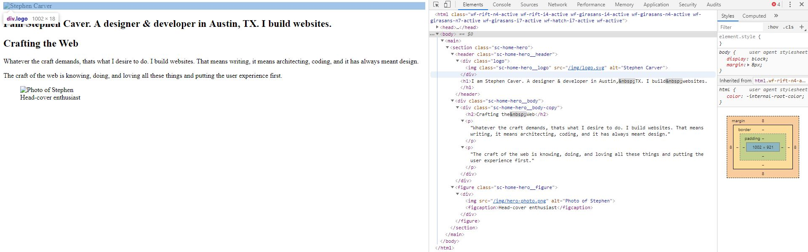
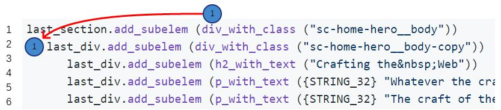

# wsf_markup - An Eiffel-based HTML Generation Library

## STATUS
This library is **UNDER CONSTRUCTION!** Please use with caution. I am actively making changes and updates and cannot make guarentees about stability of code if you use this library.

## Eiffel Only
This library is written in pure Eiffel code and [Eiffel only](https://www.eiffel.org). There are no other technologies required for this "stack". The library is designed to be consumed together with the [Eiffel Web Framework](https://github.com/EiffelWebFramework/EWF).
## Purpose
The purpose of this library is to write Eiffel code that faithfully generates well-formed HTML-5 (and other) markup code. Perhaps the fastest way to communicate is to demonstrate.
## Quick Demo
Let us say we have a code snippet of HTML that we want to generate using Eiffel by way of the wsf_markup library.
```html
<main>
...
        <section class="sc-home-hero">
          <header class="sc-home-hero__header">
            <div class="logo">
              
            </div>
            <h1>I’m Stephen Caver. A designer &amp; developer in Austin,&nbsp;TX. I build&nbsp;websites.</h1>
          </header>
          <div class="sc-home-hero__body">
            <div class="sc-home-hero__body-copy">
              <h2>Crafting the&nbsp;Web</h2>
              <p>Whatever the craft demands, that’s what I desire to do. I build websites. That means writing, it means architecting, coding, and it has always meant design.</p>
              <p>The craft of the web is knowing, doing, and loving all these things and putting the user experience first.</p>
            </div>
          </div>
          <figure class="sc-home-hero__figure">
            <div>
              
              <figcaption>Head-cover enthusiast</figcaption>
            </div>
          </figure>
        </section>
...
<main>
```
The Eiffel code used to generate this code is:
```c#
last_main.add_subelem (section_with_class ("sc-home-hero"))
   last_section.add_subelem (header_with_class ("sc-home-hero__header"))
      last_header.add_subelem (div_with_class ("logo"))
         last_div.add_subelem (img_with_class_src_alt ("sc-home-hero__logo", "/img/logo.svg", "Stephen Carver"))
            last_header.add_subelem (h1_with_text ("I am Stephen Caver. A designer &amp; developer in Austin,&nbsp;TX. I build&nbsp;websites."))
   last_section.add_subelem (div_with_class ("sc-home-hero__body"))
      last_div.add_subelem (div_with_class ("sc-home-hero__body-copy"))
         last_div.add_subelem (h2_with_text ("Crafting the&nbsp;Web"))
         last_div.add_subelem (p_with_text ({STRING_32} "Whatever the craft demands, that’s what I desire to do. I build websites. That means writing, it means architecting, coding, and it has always meant design."))
         last_div.add_subelem (p_with_text ({STRING_32} "The craft of the web is knowing, doing, and loving all these things and putting the user experience first."))
   last_section.add_subelem (figure_with_class ("sc-home-hero__figure"))
      last_figure.add_subelem (div)
         last_div.add_subelem (img_with_src_alt ("/img/hero-photo.png", "Photo of Stephen"))
         last_div.add_subelem (figcaption_with_text ("Head-cover enthusiast"))
```
This generated code can now be examined in a browser (ex: Chrome -> inspect).



## Side-by-Side
Let's examine an HTML markup line and compare it to the Eiffel wsf_markup code which will generate it.
```html
<section class="sc-home-hero">
```
Here, we have a `<section>` tag with a `class` attribute. This tag is enclosed in an already created `<main>` tag, which is represented as `last_main`, when referencing a tag already created (and ready for later generation).
```c#
last_main.add_subelem (section_with_class ("sc-home-hero"))
```
The call to `last_main.add_subelem ( ... )` is what will take our `section` object and add it to the `main`. Note that all `{HTML_ELEMENT}` classes have the `add_subelem` feature, which means all tag classes can have sub-elements unless the feature is undefined or redefined.

To create our `section` object, we make a call to `section_with_class (a_class_name: STRING_32)`.

This call will create an `{HTML_SECTION}` object and set its `class=` attribute to the value of `a_class_name`. The resulting object will later generate the needed HTML markup when its `html_out` feature is called.

**NOTE: Generating an entire segment of HTML—including nested HTML—is performed by a call to `html_out` on any {HTML_ELEMENT}.**
## What Makes Time Travel Possible!
Calls like `last_main` and `section_with_class` are made possible when inheriting from `{HTML_ELEMENT_FACTORY}`. For example: Every {HTML_ELEMENT} inherits from {HTML_ELEMENT_FACTORY}, which allows each HTML element tag object to create other HTML elements using the facilities of the factory.

In the example below, pay special attention to how the calls are made relative to the HTML being generated.



The call to `div_with_class` creates a new `{HTML_DIV}` object, creates and sets an `{HTML_STRING_ATTRIBUTE]` object as the `class` attribute on the `div`tag. It then takes the `div` object and attaches it (assigns it) to the `last-div` attribute. All of this is happening in the factory. See the `{HTML_ELEMENT_FACTORY}` for more information (see the `div` feature).

## Basic Pattern
All of the HTML tag elements in the library are represented in the `{HTML_ELEMENT_FACTORY}` class. There are essentially three staple features:
1. A `new_tag` routine, which creates an instance of the tag object and then assigns it to the `last_tag` attribute.
2. A `last_tag` attribute, which is a "self-initializing" attribute, which calls the `new_tag` feature if `last_tag` is not yet attached.
3. A `tag` query function routine, which calls `new_tag` and sets its `Result` to `last_tag`.
## Extended Creations
Beyond the three staple feature patterns above, there are various *forms* of creation. We have already seen a few examples in the sample Eiffel code above (the big block). Usually, these calls are designed to create the HTML object and then set common attributes.

**NOTE: Each attribute creation has Design-by-Contract code that helps to enforce HTML-5 specification constraints on attribute values.**

## Note about Documentation
The library makes extensive use of Eiffel class `note` clauses and `EIS` (*Eiffel Information System*) links. For example: Take a look at the {HTML_SECTION} class, which represents the `<section>` HTML tag.
```C#
note
	title: "Representation of an HTML <section> element."
	EIS: "name=specification", "src=https://www.w3.org/TR/2012/WD-html-markup-20120320/spec.html#section"
	EIS: "name=w3schools_main", "src=https://www.w3schools.com/tags/tag_section.asp"

class
	HTML_SECTION

inherit
	HTML_ELEMENT

feature -- Constants

	tag_name: STRING = "section"
			-- <Precursor>

end
```
The two EIS link give you quick access to Internet resources describing the tag class you are looking at (`<section>` in this case). There is a link to the w3.org specifications (if applicable) and to the w3schools.com link, which has general training documentation and other material. Again—there are lots of EIS links at both the class and feature levels. This is also true of HTML tag attribute classes.

## Uncoded HTML Tags
This library is **UNDER CONSTRUCTION!**. As such, you will find plenty of HTML element <tags> which have not been created yet. A temporary fix is included in the HTML factory. Take a look at this code (below):

```C#
temp_element ("tag_name", <<>>) -- Element without attributes
temp_element ("tag_name", <<create {HTML_STRING_ATTRIBUTE}.make_with_value ("attr-name", "string_value")>>)
```
The first call to `temp_element` creates a new element, which will be generated as `<tag_name>`.

The second call, will generate the same tag with an attribute: `<tag_name attr-name="string_value">`.

This is just a temporary fix to yet-to-be-coded HTML element tags. Once needed, these tags are easily coded with their attributes and added to the library (including the factory and testing).

**NOTE:** If you need to use the `temp_element` call and subsequently need to access this element, you have two basic approaches.

1. Use the `last_temp` feature.
2. Create a local (e.g. `local l_temp_element`) as a reference to the created object.

You can use option #1 (above) if you need to work with the temp element tag one at a time. The moment you require two temp tags, you will need to create at least one local.

## A Note about Style
While each `{HTML_ELEMENT}` inherits from `{HTML_ELEMENT_FACTORY}` you may want to refrain from making dot-calls to access factory calls on factory calls. For example:

```C#
last_div.last_div.add_subelem (last_div) -- THIS CODE IS DANGEROUS and a CIRCULAR reference.
```

The code (above) inserts a `Current` `last_div` object reference into one of its factory-generated `last_div` objects `sub_elements` array. I cannot vouch for what will happen. It seems the worst will be some kind of repeating call that will exhaust the call-stack. Just be aware that as it stands, you can make code structures like this that will get you into trouble.

The safest way (I have found) so far is to just use the factory of the root class you are in and never use a factory call on a factory object.
